# GoldSrc Scripts

This is a table of scripts for GoldSrc games. For greater compatibility, Bunnymod XT's *'bxt_append'* and *'w'* functions are used. Scripts with "BXT" mean that they require this program to function.

Special thanks to nin_talal, vitosnatios1 and YaLTeR.

### How to Install
1. Inject Bunnymod XT [link](https://github.com/YaLTeR/BunnymodXT)
2. Create a `userconfig.cfg` in your mod dir (valve, valve_WON, gearbox_WON, cstrike, etc)
3. Copy and paste the script code into `userconfig.cfg` (including a bind of your choice, check availability [here](https://github.com/parklez/Half-Life-Scripts/wiki/Keyboard-Mouse-Keys)) using notepad and save.
4. In-game open the console and type `exec userconfig.cfg`

### Issues and Help
**Please visit the [Wiki page](https://github.com/parklez/Half-Life-Scripts/wiki) for helpful information on scripting, performance tips and common issues!**

### Table of Contents
* [Movement](#1-movement--misc)
  * [Bunnyhop/Autojump](#bunnyhop-bxt)
  * [Duckroll/Duck Spam](#duckroll-bxt)
  * [Use Spam](#use-spam-bxt)
  * [Object Boosting](#object-boosting-bxt)
  * [Gauss Boosting](#gauss-180-boosting)
  * [Quickgauss](#quickgauss-180-steam-bxt)
  * [Nade Boosting](#nade-boosting)
  * [SMG Nade Boosting](#smg-boosting)
* [HLDM/OpenAG](#half-life-multiplayer--openag)
* [Counter-Strike 1.6](#counter-strike-16)
* [Opposing Force](#opposing-force)
* [Scripted Sequences](#2-scripted-sequences)
  * [Test Chamber](#test-chamber-a)
  * [Power Up](#power-up-a)
  * [Apprehension](#apprehension)
  * [Surface Tension](#surface-tension-valve)
  * [Forget About Freeman](#forget-about-freeman-a)
  * [Interloper](#interloper)
* [Scripted Jumpbugs](#3-jumpbugs-bxt)

### 1. Movement & Misc

#### Bunnyhop BXT
*Use BunnymodXT's **"bxt_autojump 1"** instead.*
```
alias +bhop "alias _zspecial @bhop;@bh1"
alias -bhop "alias _zspecial;-jump"
alias @bh1 "+jump;alias @bhop @bh2;bxt_append _zspecial"
alias @bh2 "w;alias @bhop @bh3;bxt_append _zspecial"
alias @bh3 "-jump;alias @bhop @bh4;bxt_append _zspecial"
alias @bh4 "w;alias @bhop @bh1;bxt_append _zspecial"
```
Example: `bind space +bhop`

#### Duckroll BXT
*For optimal movement consider using **"+bxt_tas_ducktap"***
```
alias +duckroll "alias _zspecial @duck;@dr1"
alias -duckroll "alias _zspecial;-duck"
alias @dr1 "+duck;alias @duck @dr2;bxt_append _zspecial"
alias @dr2 "w;alias @duck @dr3;bxt_append _zspecial"
alias @dr3 "-duck;alias @duck @dr4;bxt_append _zspecial"
alias @dr4 "w;alias @duck @dr1;bxt_append _zspecial"
```
Example: `bind mouse3 +duckroll`

#### Use Spam BXT
```
alias +usespam "alias _zspecial @use;@use1"
alias -usespam "alias _zspecial;-use"
alias @use1 "+use;alias @use @use2;bxt_append _zspecial"
alias @use2 "w;alias @use @use3;bxt_append _zspecial"
alias @use3 "-use;alias @use @use4;bxt_append _zspecial"
alias @use4 "w;alias @use @use1;bxt_append _zspecial"
```
Example: `bind k +usespam`

#### Object Boosting BXT

##### 2000 units/s boost (fastest)
```
alias "obbo" "+use;w 12;-use;+jump;wait;-jump"
```
Example: `bind e obbo`

##### 800 units/s boost (average)
```
alias "obbo800" "+use;w 7;-use;+jump;wait;-jump"
```
Example: `bind e obbo800`

##### "On a Rails" forward obbo with shotgun
```
alias obboshoot "+use;w 10;-use;+attack2;+jump;w;-attack2;-jump"
```
Example: `bind mouse5 obboshoot`

How to use: While facing the object, move either left or right as you activate this script. Changing the number after 'w' will affect the boost, values around 6 to 16 are good.

#### Gauss 180° Boosting
```
alias _taubo
alias _taubofunc "cl_pitchup 180;cl_pitchdown -180;-attack2;wait;cl_pitchup 89;cl_pitchdown 89;force_centerview"
alias +tau "+attack2;alias _taubo _taubofunc"
alias -tau "_taubo;alias _taubo"
```
Example: `bind mouse5 +tau`

#### Quickgauss 180° Steam BXT
*Important note: quickgauss is a trick ONLY possible on the steam version of the game, NOT WON.*

How to use:
1. Copy `quickgauss.cfg` to your `valve` dir.
2. Type in console: `exec quickgauss.cfg`.
3. Make a bind for *+gauss*, example: `bind mouse4 +gauss`.
4. Press the bind and be prepared for the discharge after ~400ms.

When you use the bind, a single gauss cell is charged, a save and load happens and the script will time the 180° based on average results, which is a 6 frame gap.

#### Nade Boosting

###### Blast Pit "Barrel Bridge"
```
alias bp_nade "cl_pitchdown 85;cl_pitchup -85;+duck;+jump;wait;-attack;w 15;-jump;-duck;cl_pitchup 89;cl_pitchdown 89;force_centerview"
```
###### Interloper c4a1c
```
alias in_nade "cl_pitchdown -35;cl_pitchup 35;+duck;+jump;w;-attack;w 15;-jump;-duck;cl_pitchup 89;cl_pitchdown 89;force_centerview"
```
How to use: Walk forward and activate.\
Example: `bind mouse5 in_nade`

#### SMG Boosting
```
alias smgboost "cl_pitchup -89;cl_pitchdown 89;w;+attack2;+jump;w;-attack2;-jump;cl_pitchup 89;cl_pitchdown 89;force_centerview"
```
How to use: Crouch for a few frames and activate it, this will boost the player vertically, useful on surface tension.\
Example: `bind g smgboost`

### Half-Life Multiplayer / OpenAG

#### Fast Zoom Crossbow
*You may increase the wait count based on latency.*
```
alias fastzoom "+attack2;+attack;wait;wait;wait;wait;lastinv;lastinv;-attack;-attack2"
```
Example: `bind mouse5 fastzoom`

#### Backwards Gauss Boosting
```
alias +tau "weapon_gauss;wait;+attack2"
alias -tau "cl_pitchup 270;cl_pitchspeed 21500;fps_max 60;wait;+lookup;wait;-lookup;-attack2;wait;+lookdown;wait;-lookdown;cl_pitchup 89;fps_max 100"
```
Example: `bind mouse5 +tau`

#### Duckroll OpenAG
```
alias ds1 "+duck;alias ds ds2;append ds"
alias ds2 "wait;alias ds ds3;append ds"
alias ds3 "-duck;alias ds ds4;append ds"
alias ds4 "wait;alias ds ds1;append ds"
alias +ds "cl_autojump 0;ds1"
alias -ds "alias ds;-duck;cl_autojump 1"
```
Example: `bind mouse3 +ds`

#### Double Duck OpenAG
```
alias dd1 "+duck;alias dd dd2;append dd"
alias dd2 "wait;alias dd dd3;append dd"
alias dd3 "-duck;alias dd dd4;append dd"
alias dd4 "wait;alias dd dd5;append dd"
alias dd5 +duck
alias +dd dd1
alias -dd "alias dd;-duck"
```
Example: `bind mouse3 +dd`

#### Use Spam OpenAG
```
alias us1 "+use;alias us us2;append us"
alias us2 "wait;alias us us3;append us"
alias us3 "-use;alias us us4;append us"
alias us4 "wait;alias us us1;append us"
alias +us us1
alias -us "alias us;-use"
```
Example: `bind e +us`

### Counter-Strike 1.6

#### Fast Switch
```
alias fastswitch "+attack2;wait;wait;wait;-attack2;+attack;wait;wait;wait;-attack;lastinv;wait;lastinv"
```
Example: `bind mouse4 fastswitch`

#### Auto Fire BXT
```
alias +aps "alias _aps @aps;@aps"
alias -aps "alias _aps"
alias @aps "+attack;wait;-attack;wait;bxt_append _aps"
```
Example: `bind mouse5 +aps`

#### Fast Walk BXT
*Also known as "ground strafe".*
```
alias "+fr" "alias _fr @fr;cl_yawspeed 0;@fr"
alias "-fr" "alias _fr;cl_yawspeed 210"
alias "@fr" "+left;+moveleft;w;-left;-moveleft;+right;+moveright;w;-right;-moveright;bxt_append _fr"
```
Example: `bind f +fr`

### Opposing Force

#### M249 180° Automatic BXT
*Must be used at 100 fps, preferably in small bursts.*
```
alias +m249 "alias _zspecial @m249;@m249_1"
alias -m249 "-attack;alias _zspecial"
alias @m249_1 "cl_pitchup 180;cl_pitchdown -180;+attack;alias @m249 @m249_2;bxt_append _zspecial"
alias @m249_2 "w;cl_pitchdown 89;cl_pitchup 89;force_centerview;alias @m249 @m249_3;bxt_append _zspecial"
alias @m249_3 "w;alias @m249 @m249_4;bxt_append _zspecial"
alias @m249_4 "w;alias @m249 @m249_5;bxt_append _zspecial"
alias @m249_5 "w;alias @m249 @m249_6;bxt_append _zspecial"
alias @m249_6 "w;alias @m249 @m249_7;bxt_append _zspecial"
alias @m249_7 "w;alias @m249 @m249_8;bxt_append _zspecial"
alias @m249_8 "w;alias @m249 @m249_1;bxt_append _zspecial"
```
Example `bind mouse5 +m249`

#### Throwing nades below the door on "Friendly Fire"
*Also works on They Hunger 1.*
```
alias door "fps_max 19.5;cl_pitchdown 60.5;cl_pitchup -60.5;+duck;w 5;fps_max 19.5;+attack;w;-attack;w 25;+attack;w;-attack;w 15;fps_max 99.5;-duck;cl_pitchup 89;cl_pitchdown 89"
```
Example: `bind g door`

### 2. Scripted Sequences
All sequences require Bunnymod XT [link](https://github.com/YaLTeR/BunnymodXT) and must be done at stable 100 fps, if your computer struggles to keep up, scripts will fail. Check possible solutions on the wiki [link](https://github.com/parklez/Half-Life-Scripts/wiki). For scripts requiring angles, use `bxt_hud_viewangles 1`.\
Tip: In case something goes wrong, `exec userconfig.cfg` and try again.

#### Test Chamber A
*This version is currently NOT allowed by speedrun.com/hl1 rules.*
```
alias testchamber "+moveright;+back;w 30;+use;w 4;-use;w 40;-moveright;-back;w 100;+left;w 6;-left;wait;+moveright;w 22;+use;w 11;-use;+duck;wait;-duck;-moveright;w 40;+back;w 13;-back"
```
How to use: Stay on the left corner between cart cage and wall, after the cart fully arrives, activate it. Must be done within these angles: **pitch 30~40, yaw 125.05 ~ .09**

#### Test Chamber B
*This version is allowed, functions like A.*
```
alias testchamber "tc1"
alias tc1 "w 100;w 100;alias testchamber tc2"
alias tc2 "w 10;w 10;w 10;+use;wait;wait;wait;wait;-use;w 10;w 10;w 10;w 10;-moveright;-back;w 100;alias testchamber tc3"
alias tc3 "wait;wait;wait;wait;wait;wait;-left;wait;alias testchamber tc4"
alias tc4 "w 10;wait;wait;wait;wait;wait;wait;wait;wait;wait;wait;wait;wait;+use;w 10;wait;-use;+duck;wait;-duck;-moveright;w 10;w 10;w 10;w 10;alias testchamber tc5"
alias tc5 "w 10;wait;wait;wait;-back;alias testchamber tc1"

bind 6 "alias testchamber tc1"
bind 7 +left
bind 8 +moveright
bind 9 +back
bind 0 testchamber
```
Video guide: [link](https://youtu.be/rtkwF-nAP4s)

How to use: Stay on the left corner between cart cage and wall, when the cage starts to decend, follow the steps. Must be done within these angles: **pitch 30~40, yaw 125.05 ~ .09**

1. press 0
2. hold s+d+0 then release
3. hold 7+0 then release
4. hold 8+0 then release
5. hold 9+0 then release

#### Test Chamber C
*This version is slightly faster than A/B but harder to hit the trigger.*
```
alias testchamber "tc1"
alias tc1 "w 200;alias testchamber tc2"
alias tc2 "w 10;w 10;w 10;+use;wait;-moveright;wait;wait;wait;-use;alias testchamber tc3"
alias tc3 "w 10;w 10;w 50;cl_pitchup -89;+use;w 10;wait;wait;wait;wait;-use;cl_pitchup 89;-moveright;-back;cl_pitchdown 30;w 50;+use;alias testchamber tc4" 
alias tc4 "w 10;wait;wait;wait;wait;-use;w 50;w 10;-moveright;cl_pitchdown 89;alias testchamber tc1"

bind 8 +back
bind 9 +moveright
bind 0 testchamber
```
How to use: Stay on the left corner between cart cage and wall, when the cage starts to decend, follow the steps. Must be done within these angles: **pitch 30~40, yaw 136.5 ~ .49**

1. press 0
2. hold 8+9+0 then release
3. hold 8+9+0 then release
4. hold 9+0 then release

#### Test Chamber D
*Probably the "best" version, it offers an edge bug to cancel fall damage.*
```
alias testchamber "tc1"
alias move "+moveright"

alias tc1 "w 200;alias testchamber tc2;alias move +moveright"
alias tc2 "alias testchamber tc3;alias move +back"
alias tc3 "w 30;+use;wait;-moveright;wait;wait;wait;-use;alias testchamber tc4;alias move +moveright"
alias tc4 "w 70;cl_pitchup -89;+use;w 10;wait;wait;wait;wait;-use;cl_pitchup 89;-moveright;-back;cl_pitchdown 30;w 50;+use;alias testchamber tc5" 
alias tc5 "w 10;wait;wait;wait;wait;-use;w 10;-moveright;w 30;cl_pitchdown 89;alias testchamber tc6;alias move +forward"
alias tc6 "cl_pitchdown 180;cl_pitchup -170;w 9;cl_pitchup 89;cl_pitchdown 40;wait;cl_pitchdown 89;-forward;w 63;alias testchamber tc7;alias move +moveleft"
alias tc7 "alias testchamber tc8;alias move +left"
alias tc8 "w 50;-moveleft;w 100;-left;fps_max 40;w 11;fps_max 100;alias testchamber tc9;alias move +forward"
alias tc9 "w 40;-forward"

bind 9 move
bind 0 testchamber 
```
How to use: Stay on the left corner between cart cage and wall, when the cage starts to decend, follow the steps. It helps if you have `developer 1` to see the level change being triggered. Must be done within these angles: **pitch 30~40, yaw 136.51 ~ .40**

1. 0, 9, 0, 9, 0, 9, 0, 9, 0, 9, 0, 9, 0, 9, 0

Basically (0 then 9) times seven then '0' once.
After touching the level change trigger up there you may continue:

2. 9 then 0
3. hold A + duck

#### Power Up A
```
alias puskip "-jump;-moveright;-moveleft;speak fvox/power_level_is;w 100;speak fvox/beep;w 100;speak fvox/beep;w 100;speak fvox/beep;w 100;speak fvox/beep;w 100;speak fvox/beep;w 100;speak fvox/beep;cl_pitchdown 180;cl_pitchup -179;w 30;cl_pitchup -30;cl_pitchdown 31;wait;cl_pitchup 89;cl_pitchdown 89;w 10;+use;w 11;-use;+jump;wait;-jump"
```
How to use: TODO

#### Power Up B
*Facing forward, no object boost.*
```
alias puskip "speak fvox/power_level_is;w 100;speak fvox/beep;w 100;speak fvox/beep;w 100;speak fvox/beep;w 100;speak fvox/beep;w 100;speak fvox/beep;w 50"
```
How to use: link soon

#### Apprehension
```
alias captured "ct1"

alias ct1 "fps_max 100;w 2205;alias captured ct2"
alias ct2 "w 164;alias captured ct3"
alias ct3 "w 6;+speed;w 21;-right;-speed;alias captured ct4"
alias ct4 "w 11;+jump;+duck;w 21;-forward;alias captured ct5"
alias ct5 "w 15;-moveright;-right;w 50;alias captured ct6"
alias ct6 "w 30;-duck;-jump;-moveleft;-left;w 40;cl_pitchdown 89.999;cl_pitchup -89.999;wait;+use;wait;-use;wait;alias captured ct7"
alias ct7 "wait;-forward;wait;alias captured ct8"
alias ct8 "wait;-forward;wait;alias captured ct9"
alias ct9 "wait;-forward;wait;alias captured ct10"
alias ct10 "wait;-forward;wait;+use;wait;-use;cl_pitchup 89;cl_pitchdown 89"

bind 7 captured
```
How to use: Lower fps to 8 and do step 1 when you see the "loading" for the two soldiers talking cutscene.

1. 7
2. s+7
3. rightarrow+7
4. w+7
5. d+rightarrow+7
6. a+leftarrow+7
7. w+7
8. w+7
9. w+7
10. w+7

#### Surface Tension Valve
```
alias valve "v1"

alias v1 "w 100;alias valve v2"
alias v2 "w 195;-forward;w 220;-moveleft;alias valve v3"
alias v3 "w 125;alias valve v1"

bind 6 valve
```
How to use: ???

1. 6
2. W+A+6
3. W+6

#### Forget About Freeman A
```
alias faf "save quick;speak fvox/power_level_is.beep._comma.beep._comma.beep._comma.beep;-moveright;-moveleft;-duck;weapon_crowbar;+attack;w 500;weapon_handgrenade;w 40;cl_pitchdown 180;cl_pitchup -179;w 40;cl_pitchup 89.999;cl_pitchdown 89.999;cl_pitchup -40;cl_pitchdown 40.001;w 30;-attack;w 4;+jump;+duck;wait;-jump;-duck;cl_pitchup 89;cl_pitchdown 89;w 61"
```
How to use: TODO

#### Forget About Freeman B
*This version uses a smg nade to scare the vortigaunts off.*
```
alias faf "w 400;smg;w 1;weapon_handgrenade;w 10;+attack;w 50;cl_pitchdown 180;cl_pitchup -179;w 40;cl_pitchup 89.999;cl_pitchdown 89.999;cl_pitchup -40;cl_pitchdown 40.001;w 30;-attack;w 4;+jump;+duck;w 1;-jump;-duck;cl_pitchup 89.999;cl_pitchdown 90;w 61"
alias smg "cl_pitchdown 180;cl_pitchup -179;w 1;+attack2;w 1;cl_pitchup 89;cl_pitchdown 89;-attack2"
```
How to use: link soon

#### Interloper
```
alias in_dboost "-forward;cl_pitchdown 89;cl_pitchup -89;-attack;w;+duck;+jump;weapon_9mmAR;w 45;cl_pitchdown 32;cl_pitchup -32;+attack2;w 10;-duck;-jump;-attack2;cl_pitchup 89;cl_pitchdown 89;force_centerview;weapon_gauss"
```
How to use: link soon

### 3. Jumpbugs BXT
FPS values used are pre-steampipe, if `version` in your console outputs `Exe build: [...]` from 2013 or later, subtract 0.5 fps from `fps_max` values within the script in order to work.\
Spreadsheet by Jukspa [link](https://docs.google.com/spreadsheets/d/1AREhZEdayLHF6bJpSCtpFVtM-foPVs6e8nHFuvAXsPw/edit?usp=sharing)

How to use:
1. Download this repository clicking [here](https://github.com/parklez/Half-Life-Scripts/archive/master.zip) then move the script you want inside the mod dir (valve, valve_WON, gearbox_WON, etc).
2. Load the script you want: `bind F2 "exec jb_example.cfg"` OR type in console `exec jb_example.cfg`
3. Make a bind for "+jumpbug": `bind mouse4 +jumpbug`
4. Hold down "+jumpbug" until it's over, you can move/attack freely. The script jumps and jumpbugs automatically.

**Video showcase for most jumpbugs: [link](https://youtu.be/dxPG7A0w3aU)**

The table below shows where to execute each script. (Specific spots outlined in green)

| Script                    | Jump (+jumpbug)                     | Land                                |
| ------------------------- | ----------------------------------- | ----------------------------------- |
|jb_am.cfg                  | 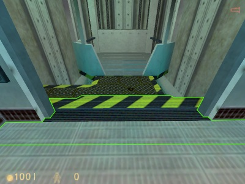            | 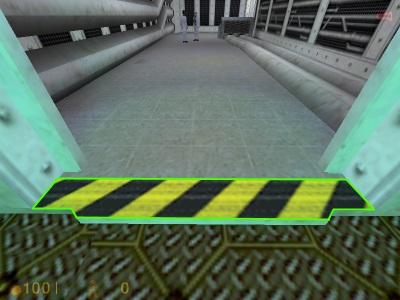            |
|jb_blastpitfall.cfg        | 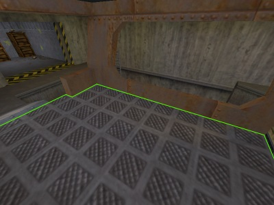  | 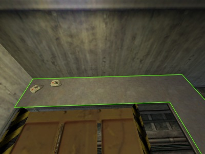  |
|jb_blastpitbox.cfg         | 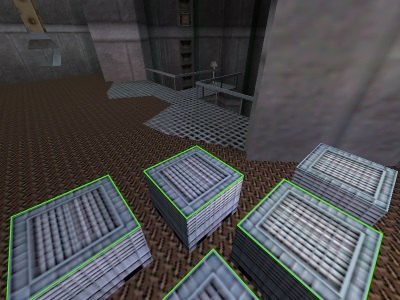   | 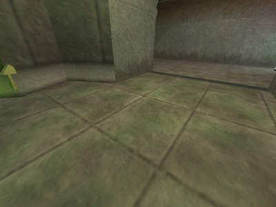   |
|jb_blastbutton.cfg         | 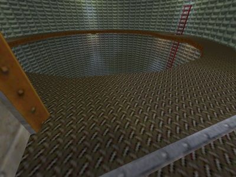   | 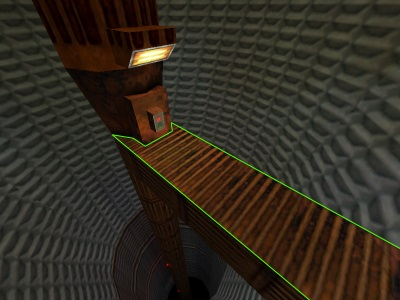   |
|jb_blastpitpipe.cfg        | 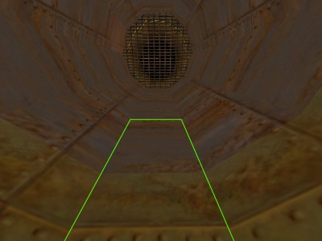  | 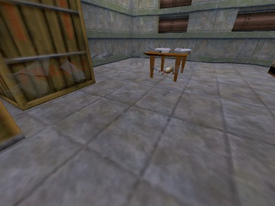  |
|jb_rails.cfg               | 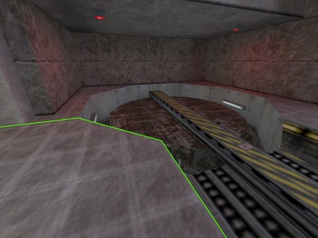         | 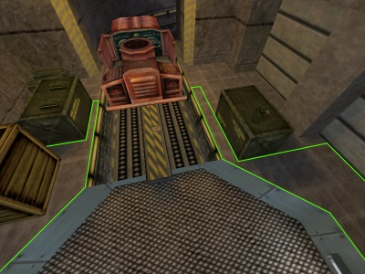         |
|jb_rp.cfg                  | 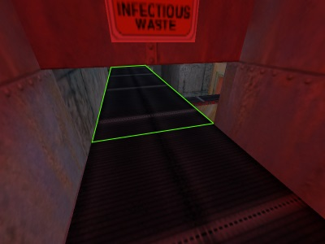            | 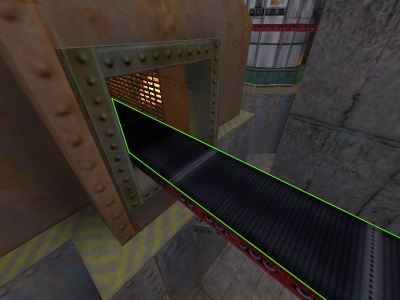            |
|jb_op4.cfg                 | 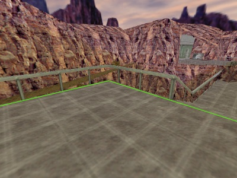           | 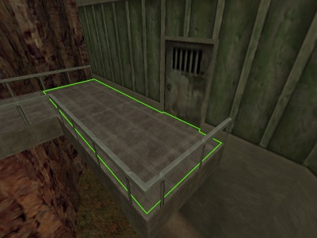           |
|jb_they9_steampipe.cfg     | 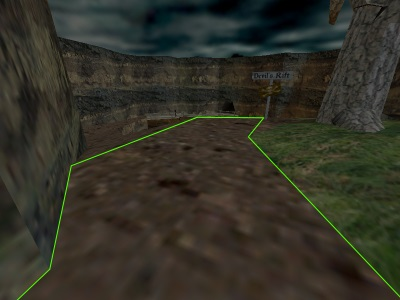 | 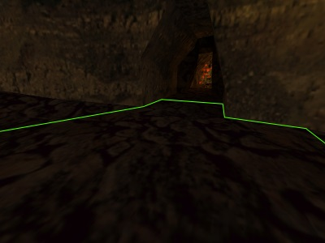 |
